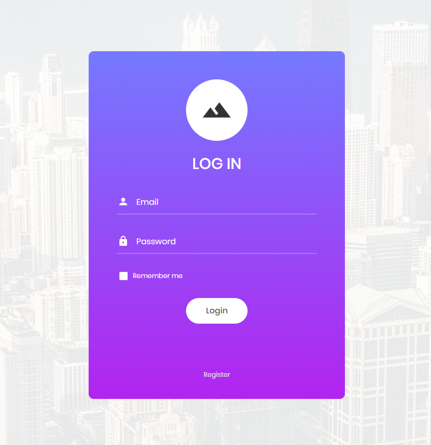
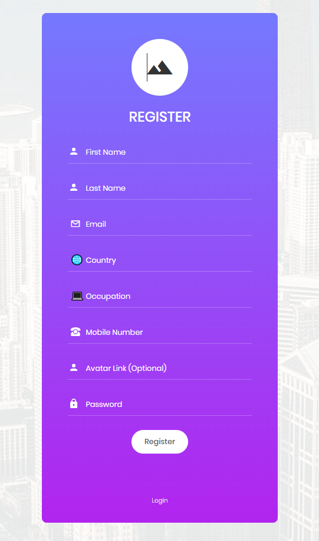
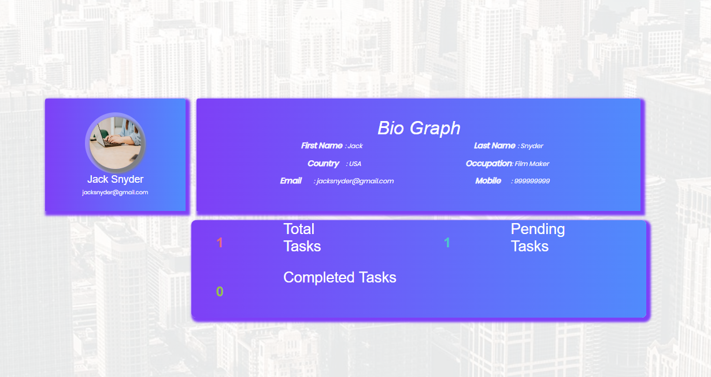
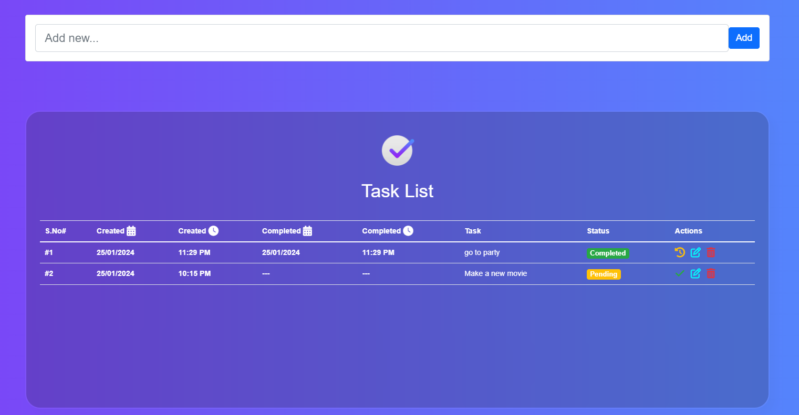

<h1 align="center">
🌐 MERN Stack
</h1>

<p align="center">
   <a href="https://github.com/amazingandyyy/mern/blob/master/LICENSE">
      
   </a>
   <a href="https://circleci.com/gh/amazingandyyy/mern">
      
   </a>
</p>

> MERN is a fullstack implementation.

MERN stack is the idea of using Javascript/Node for fullstack web development.
## Getting Started
This repository aims to assist you in running this project work on a MERN stack application with a solid file structure as a foundation. To get started make a copy of this template repo for your project teams.

Since this project will hold both the client application and the server application there will be node modules in two different places. First run `npm install` from the root. After this you will run `npm run-script install-all` from the root. From now on run this command anytime you want to install all modules again. This is a script we have defined in package.json .


**Here is a step by step guide to start the project in your local machine to run it**

## clone or download

First you need to make a new folder where you can clone or downlaod this repository, try making a new folder and use this command to initialize it.
```terminal
$ git init
```
**This will initialize a empty git repository. Then follow the steps mentioned below!**

```terminal
$ git clone https://github.com/BasicNik/task-management-m.git
```
After Cloning the repo, run this command in both the folders to install npm packages.
```terminal
$ npm install --global
```
**Note* to check is it is installed correctly or not, run this command to ensure.
```terminal
$ npm -v
```


# Usage (run fullstack app on your machine)

## Prerequisites
- [MongoDB](https://gist.github.com/nrollr/9f523ae17ecdbb50311980503409aeb3)
- [Node](https://nodejs.org/en/download/) ^10.0.0
- [npm](https://nodejs.org/en/download/package-manager/)

**Notice, you need client and server runs concurrently in different terminal session, in order to make them talk to each other**

## Client-side usage(PORT: 3000)
```terminal
$ cd client          // go to client folder
$ yarn # or npm i    // npm install packages
$ npm run dev        // run it locally

// deployment for client app
$ npm run build // this will compile the react code using webpack and generate a folder called docs in the root level
$ npm run start // this will run the files in docs, this behavior is exactly the same how gh-pages will run your static site
```
This will run the server on your local network at [http://localhost:5173/](http://localhost:5173/)

## Server-side usage(PORT: 4000)

### Prepare your secret

run the script at the first level:

(You need to add a JWT_SECRET in .env to connect to MongoDB)

```terminal
// in the root level
$ cd server
$ echo "JWT_SECRET=YOUR_JWT_SECRET" >> src/.env
```

### Start

```terminal
$ cd server   // go to server folder
$ npm i       // npm install packages
$ npm run dev // run it locally
$ npm run build // this will build the server code to es5 js codes and generate a dist file
```

# Dependencies(tech-stacks)
Client-side | Server-side
--- | ---
axios: ^0.15.3 | bcrypt-nodejs: ^0.0.3
babel-preset-stage-1: ^6.1.18|body-parser: ^1.15.2
lodash: ^3.10.1 | cors: ^2.8.1
react: ^16.2.0 | dotenv: ^2.0.0
react-dom: ^16.2.0 | express: ^4.14.0
react-redux: ^4.0.0 | jwt-simple: ^0.5.1
react-router-dom: ^4.2.2 | mongoose: ^4.7.4
redux: ^3.7.2 | morgan: ^1.7.0
redux-thunk: ^2.1.0 |

# Screenshots of this project
<p align="center"> 
**Login Page Screenshot**
</p>


<p align="center"> 
**Registration Page Screenshot**
</p>
   


<p align="center"> 
**Account Details Page Screenshot**
</p>



<p align="center"> 
**Task Management Page Screenshot**
</p>




## Standard

[](https://github.com/standard/standard)

## BUGs or comments

[Create new Issues](https://github.com/BasicNik/task-management-m/issues) (preferred)


Email Me: basicnik1798@gmail.com (welcome, say hi)

## Author
[BasicNik](https://basicnik.vercel.app)

